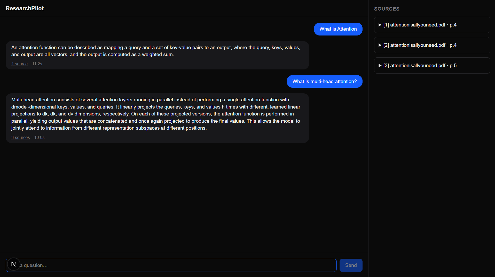
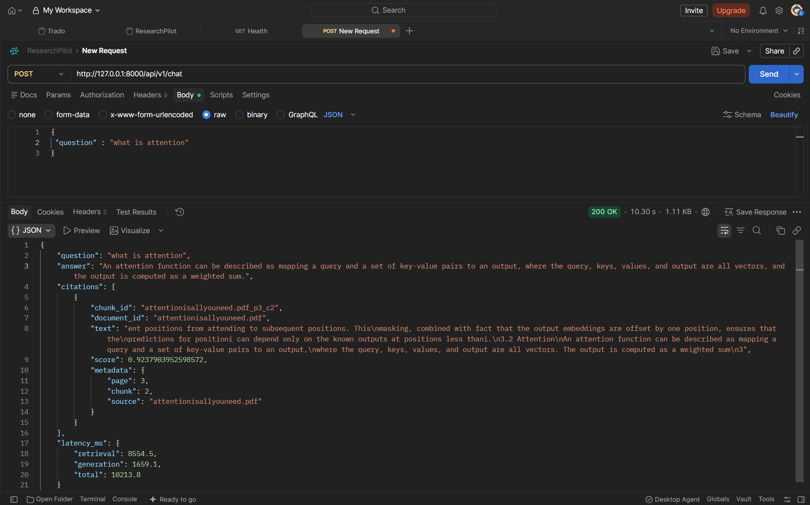

# ResearchPilot v0.4 — API and Chat UI

v0.4 wraps the grounded RAG pipeline from v0.3 in a FastAPI service and adds a Next.js chat interface on top of it.

- v0.2 focused on retrieving the right evidence.
- v0.3 connected that evidence to a complete generation pipeline.
- v0.4 makes that pipeline usable as an application: an HTTP API and a chat UI with sources.

## Demo



```
Next.js Chat UI
      ↓
FastAPI  (POST /api/v1/chat)
      ↓
RAGPipeline
      ↓
Hybrid Retrieval (Vector + BM25 + RRF) → Reranker (Top-5)
      ↓
Gemini (structured JSON)
      ↓
Answer + Validated Citations
```

## What We Added

### 1. FastAPI Service

Added an `api/` module around `RAGPipeline`:

```
src/researchpilot/api/
├── main.py       app creation, startup, CORS
├── deps.py       shared pipeline dependency
├── schemas.py    request / response models
└── routes/
    ├── chat.py   POST /api/v1/chat
    └── health.py GET /health
```

| Endpoint | Method | Purpose |
|---|---|---|
| `/api/v1/chat` | POST | Ask a question, get a grounded answer with citations |
| `/health` | GET | Service health check |

### 2. Pipeline Built Once at Startup

The embedding model, the BGE reranker, the Chroma vector store and the BM25 index are loaded once when the server starts, not on every request.

```
Server start
      ↓
Load embedder + reranker + Chroma + BM25
      ↓
Build RAGPipeline (single shared instance)
      ↓
Requests reuse the same pipeline
```

Loading these per request would add model-load time to every question. Building the pipeline once keeps request latency down to the actual retrieval and generation work.

### 3. Chat Request and Response

Request:

```json
{
  "question": "what is attention"
}
```

Response:

```json
{
  "question": "what is attention",
  "answer": "An attention function can be described as mapping a query and a set of key-value pairs to an output, where the query, keys, values, and output are all vectors, and the output is computed as a weighted sum.",
  "citations": [
    {
      "chunk_id": "attentionisallyouneed.pdf_p3_c2",
      "document_id": "attentionisallyouneed.pdf",
      "text": "... 3.2 Attention\nAn attention function can be described as mapping a query and a set of key-value pairs to an output, ...",
      "score": 0.9237903952598572,
      "metadata": {
        "page": 3,
        "chunk": 2,
        "source": "attentionisallyouneed.pdf"
      }
    }
  ],
  "latency_ms": {
    "retrieval": 8554.5,
    "generation": 1659.1,
    "total": 10213.8
  }
}
```

The same request in Postman:



Each citation is a chunk that passed citation validation in the pipeline, returned with its text, score and metadata so a client can show the evidence behind the answer.

### 4. Latency Reporting

Every response includes `latency_ms`, broken down by stage:

| Field | Meaning |
|---|---|
| `retrieval` | Hybrid search, RRF fusion and reranking |
| `generation` | Prompt building and the Gemini call |
| `total` | Full pipeline time for the request |

This makes it visible where a request spends its time. In the example above, retrieval accounts for most of the total, which makes it the first place to look for speedups.

### 5. Next.js Chat UI

Added a `frontend/` app built with Next.js and TypeScript:

- Chat page for asking questions
- Answer display
- Sources panel showing the cited evidence chunks
- Loading state while the pipeline runs
- Error state when a request fails

CORS is configured on the API so the frontend can call it from a different origin during development.

### 6. API Tests

Added basic API tests covering the chat and health endpoints, alongside the existing ingestion, retrieval and pipeline tests.

## Architecture

The v0.3 pipeline is unchanged. v0.4 adds the two layers above it.

```
                        Next.js Chat UI
              (question, answer, sources panel)
                              │
                              ▼
                           FastAPI
                  POST /api/v1/chat · GET /health
                              │
                              ▼
                         RAGPipeline
                              │
                 ┌────────────┴────────────┐
                 ▼                         ▼
           Vector Search              BM25 Search
              Top-20                    Top-20
                 │                         │
                 └────────────┬────────────┘
                              ▼
                         RRF Fusion
                          (k = 60)
                              │
                              ▼
                     BGE Cross-Encoder
                         Reranking
                              │
                              ▼
                    Top-5 Evidence Chunks
                              │
                              ▼
                       Prompt Builder
                              │
                              ▼
                           Gemini
                              │
                              ▼
                  Structured Answer + IDs
                              │
                              ▼
                     Citation Validation
                              │
                              ▼
               Answer + Citations + latency_ms
```

## Project Structure

```
researchpilot/
├── frontend/          Next.js + TypeScript chat UI
├── src/researchpilot/
│   ├── api/           main.py, deps.py, schemas.py, routes/ (chat, health)
│   ├── ingestion/     loader.py, chunker.py, ingest.py
│   ├── retrieval/     bm25.py, embedder.py, vector_store.py,
│   │                  hybrid.py, reranker.py, reranked.py
│   ├── generation/    llm.py, prompt.py, schemas.py
│   ├── pipeline/      rag.py
│   └── config/        settings.py
├── tests/             ingestion/, retrieval/, query/, pipeline/test_rag.py
├── experiments/       notebooks/, retrieval/, evaluation/
└── data/              raw/, processed/, evaluation/
```

## Running Locally

Backend:

```bash
uvicorn researchpilot.api.main:app --reload
```

Frontend:

```bash
cd frontend
npm install
npm run dev
```

Example request:

```bash
curl -X POST http://localhost:8000/api/v1/chat \
  -H "Content-Type: application/json" \
  -d '{"question": "What is the main finding of the Transformer paper?"}'
```

## v0.3 → v0.4

| Area | v0.3 | v0.4 |
|---|---|---|
| Retrieval | Hybrid Vector + BM25 | Unchanged |
| Fusion | RRF (k = 60) | Unchanged |
| Ranking | BGE Cross-Encoder | Unchanged |
| Generation | Gemini, structured output | Unchanged |
| Citations | Citation validation | Unchanged, now returned with text, score and metadata |
| Interface | Python pipeline (`pipeline/rag.py`) | FastAPI service + Next.js chat UI |
| Model loading | Per pipeline construction | Once at server startup |
| Observability | — | `latency_ms` in every response |
| Testing | End-to-end integration test | + basic API tests |

## Why This Change Matters

Until v0.3, ResearchPilot could only be used by calling the pipeline from Python. The retrieval and generation work was there, but nobody could ask it a question without the codebase open.

v0.4 puts an explicit interface in front of the pipeline:

- The API gives the pipeline a stable contract: one request shape, one response shape.
- The UI shows the answer and the evidence side by side, which is the point of a grounded system.
- `latency_ms` makes the cost of each request visible instead of assumed.

## Engineering Lesson

v0.2 showed that retrieval quality and ranking quality are separate problems. v0.3 extended that to generation. v0.4 applies the same idea to serving:

> The pipeline and the way it is served are separate concerns.

`RAGPipeline` knows nothing about HTTP. The API layer knows nothing about retrieval or prompts. It builds the pipeline once, passes questions in and returns the result. That boundary is what allowed the frontend and the API to be added without touching retrieval, generation or citation validation.

## Current Limitations

This release is a single-user, local application. It does not yet include:

- Authentication
- Multi-tenancy or tenant context
- Rate limiting
- Streaming responses
- Redis or background queues
- User feedback on answers

Answer quality is also still unevaluated. The open items from v0.3 remain:

- Evaluating answer correctness against `expected_answer`
- Measuring citation correctness and completeness
- Detecting unsupported claims in generated answers
- Expanding the benchmark beyond 40 questions and 4 papers
- Moving from page-level to chunk-level evidence evaluation

## Next Target

```
Next.js Chat UI (streaming, sources, feedback)
        ↓
FastAPI (auth, tenant context, rate limits)
        ↓
RAGPipeline
        ↓
Hybrid Retrieval (vector + BM25 + RRF) → Reranker (top-5)
        ↓
Gemini (structured JSON)
        ↓
Answer + Validated Citations
```

The next step is moving from a working application to a production-shaped one: streaming answers to the UI, collecting feedback, and adding auth, tenant context and rate limits at the API layer.

## ResearchPilot Progression

```
v0.1 — Basic / Naive RAG
        │   Vector Retrieval → LLM Answer
        ▼
v0.2 — Better Retrieval
        │   Vector + BM25 → RRF Fusion → BGE Reranking → Top-5
        ▼
v0.3 — Grounded Answer Generation
        │   Prompt Builder → Gemini → Structured Output → Citation Validation
        ▼
v0.4 — API and Chat UI
        │   FastAPI service → Next.js chat with sources
        ▼
   Usable RAG Application
```